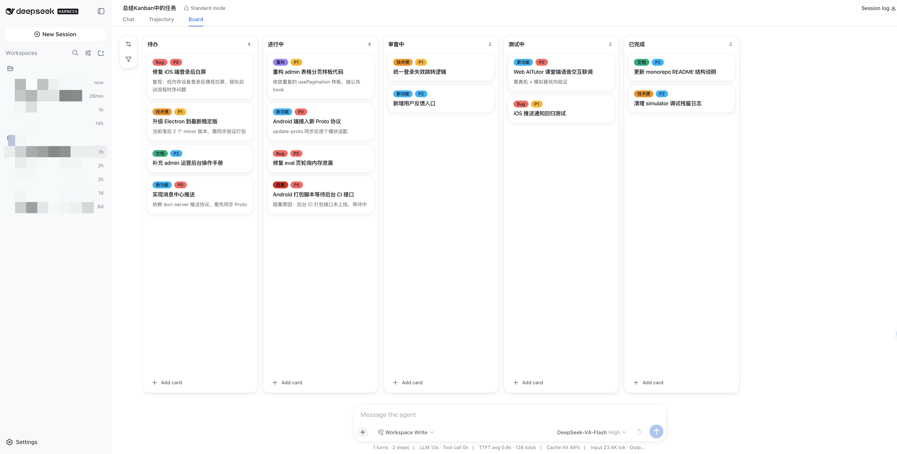

<div align="center">

# dsh-kanban

**Plan with your AI. See the work move.**

A shared kanban board for [DeepSeek Harness](https://github.com/deepseek-ai/deepseek-harness), built for both people and agents.

[简体中文](README.zh.md) · English

</div>

Turn a conversation into an actionable plan without copying tasks between your AI assistant and a project tracker. Ask the agent to break down a feature, prioritize a bug, or move finished work—the same changes appear instantly in the **Board** tab, where you can continue organizing everything by hand.

<p align="center">
  
</p>

## Why dsh-kanban?

- **Plan in conversation** — 14 `kanban_*` tools let the agent create and manage cards, lists, and labels.
- **Stay in control** — edit cards, drag work between lists, reorder your workflow, and filter by priority from the UI.
- **Keep projects separate** — every DSH workspace gets its own board and persisted data.
- **Feel at home in DSH** — the board follows the active language and theme, including dark mode.
- **Install and go** — the browser bundle is prebuilt; no frontend toolchain or native build step is required.

## Quick start

### 1. Install the plugin

Install the published npm package:

```sh
dsh plugin --profile web add @alpacachen/dsh-kanban
```

GitHub source checkouts are not a supported installation method because the generated browser bundle is created only by CI for the npm package.

Restart `dsh web` after installation so the plugin bundle is loaded. To confirm that it was added successfully:

```sh
dsh --profile web --dump-config
```

The output should include a `dsh-kanban` layer.

### 2. Open the board

Open a workspace and select the **Board** tab next to the conversation views. A new board starts with **Todo**, **In Progress**, **Review**, and **Done**.

### 3. Plan with the agent

Try a prompt like:

> Break the authentication feature into implementation tasks, add one card per step, and mark the security review as P0.

The agent updates the board directly. You can then refine the plan in the UI, or keep working through conversation.

## What you can do

### From the Board tab

- Create, edit, delete, and drag cards between lists
- Add notes, labels, and P0 / P1 / P2 priorities
- Create, rename, reorder, and remove lists
- Create labels and customize their colors
- Filter the board by priority

### From a conversation

The plugin makes these tools available automatically in every workspace conversation:

| Area | Tools |
| --- | --- |
| Board | `kanban_get` |
| Cards | `kanban_get_card`, `kanban_add_card`, `kanban_update_card`, `kanban_delete_card`, `kanban_move_card` |
| Lists | `kanban_add_column`, `kanban_rename_column`, `kanban_delete_column`, `kanban_move_column` |
| Labels | `kanban_get_label`, `kanban_add_label`, `kanban_update_label`, `kanban_delete_label` |

A few more things you can ask:

- “Summarize what is currently in progress.”
- “Move ‘Fix login redirect’ to In Progress and set it to P0.”
- “Add a Blocked list after In Progress.”
- “Create a red Urgent label and apply it to the release card.”

## Data and persistence

Boards are isolated by workspace and stored through the DSH filesystem service as `kanban-board-<workspaceId>.json`. They survive browser refreshes and DSH restarts, and uninstalling the plugin does not delete existing board data.

### Schema versioning and safe migration

Persisted files carry a `schemaVersion` field (currently `1`). Files written by older versions (without a version field) are treated as `v0` and are **automatically upgraded the first time the workspace board is opened** — the pre-upgrade file is copied to `kanban-board-<workspaceId>.json.bak-v0` first, then the upgraded file is written back. Future format changes simply bump `SCHEMA_VERSION` and register a step-by-step migration function in `MIGRATIONS` (`index.js`).

#### Adding a future format version (e.g. v2)

Migration functions live in `MIGRATIONS` in `index.js` and are pure functions — they transform data only, never touch the filesystem or runtime state. Each step upgrades by exactly one version; `migrateBoard` chains them automatically, so a `v0` file walks `v0 → v1 → v2`. Backups and write-back are handled by the load pipeline.

```js
export const SCHEMA_VERSION = 2 // 1) bump the version

export const MIGRATIONS = {
  0: (data) => ({ /* existing v0 → v1, unchanged */ }),
  1: (data) => ({
    schemaVersion: 2, // 2) output must declare the new version
    columns: data.columns,
    labels: data.labels,
    cards: data.cards.map((c) => ({ ...c, labelId: c.label ?? null })), // e.g. label → labelId
  }),
}
```

If the on-disk shape changes, update `validateBoard` in `index.js` and the client types in `src/client/lib/types.ts` accordingly, and extend the self-checks in `scripts/check-schema.mjs` / `scripts/check-pipeline.mjs`.

Abnormal data never makes the board unusable:

- **Corrupt/unparseable files** are backed up to `kanban-board-<workspaceId>.json.corrupt-<timestamp>` and the board opens empty, with a clear notice.
- **Files from a newer plugin version** (higher `schemaVersion`) are backed up to `kanban-board-<workspaceId>.json.unsupported-v<version>` and left untouched, so no data is destroyed by a downgraded plugin.
- At plugin startup a **validation scan** checks every board file (parse + version + structure), backs up any corrupt files, and logs a summary.

Notices from migrations, corruption, or unsupported versions are surfaced both in the agent tool results (`warnings`) and as a banner in the Board tab.

## How it works

`dsh-kanban` uses the standard DSH bundle format:

- `index.js` registers the agent tools and the `/api/kanban` browser endpoint.
- Both interfaces share one data layer, so the agent and the Board tab always operate on the same board.
- `cordis.patch.yml` adds the plugin to the selected DSH profile.
- `lib/client.js` is the prebuilt web client loaded by DSH.

The client is built with React, TypeScript, Tailwind CSS, shadcn/ui, Radix UI, and dnd-kit. React itself is provided by DSH, keeping the distributed bundle smaller and avoiding duplicate runtimes.

## Development

Requirements: Node.js and pnpm.

```sh
pnpm install
pnpm build
pnpm typecheck
```

For an unminified client bundle while debugging:

```sh
node build.mjs --no-minify
```

Project layout:

```text
index.js              # Host plugin, tools, persistence, and HTTP endpoint
cordis.patch.yml      # DSH bundle patch
build.mjs             # Client build script
src/client/           # React and TypeScript source
lib/client.js         # Generated locally or by CI; included only in the npm package
```

## Contributing

Issues and pull requests are welcome. If you are planning a larger change, opening an issue first is a good way to align on the approach before implementation.

## Uninstall

```sh
dsh plugin --profile web remove @alpacachen/dsh-kanban
```

## License

MIT
